# EnterpriseFlow — Core Module ER Diagram

Covers the 11 tables in `database/core/` (Goal 3 master data). See
`docs/database_design.md` for the reasoning behind these relationships.

```mermaid
erDiagram
    ORGANIZATION ||--o{ DEPARTMENT : "has"
    ORGANIZATION ||--o{ CLIENT : "has"
    ORGANIZATION ||--o{ LOCATION : "has"
    ORGANIZATION ||--o{ USER_ACCOUNT : "has"
    ORGANIZATION ||--o{ EMPLOYEE : "has"
    ORGANIZATION ||--o{ PROJECT : "has"

    DEPARTMENT ||--o{ ROLE : "has"
    DEPARTMENT ||--o{ EMPLOYEE : "assigns"

    ROLE ||--o{ EMPLOYEE : "assigns"

    EMPLOYEE |o--o{ USER_ACCOUNT : "optionally logs in as"
    EMPLOYEE |o--o{ TASK : "optionally assigned"

    CLIENT |o--o{ PROJECT : "optionally billed to"

    PROJECT ||--o{ TASK : "has"

    STATUS |o--o{ PROJECT : "current status of"
    STATUS |o--o{ TASK : "current status of"

    PRIORITY ||--o{ TASK : "priority of"

    ORGANIZATION {
        NUMBER organization_id PK
        VARCHAR2 organization_name
        VARCHAR2 organization_code UK
        VARCHAR2 email
        VARCHAR2 phone
        CHAR active_flag
    }

    DEPARTMENT {
        NUMBER department_id PK
        NUMBER organization_id FK
        VARCHAR2 department_name
        VARCHAR2 department_code UK
        CHAR active_flag
    }

    ROLE {
        NUMBER role_id PK
        NUMBER department_id FK
        VARCHAR2 role_name
        VARCHAR2 role_code UK
        VARCHAR2 description
        CHAR active_flag
    }

    EMPLOYEE {
        NUMBER employee_id PK
        NUMBER organization_id FK
        NUMBER department_id FK
        NUMBER role_id FK
        VARCHAR2 employee_code UK
        VARCHAR2 first_name
        VARCHAR2 last_name
        VARCHAR2 email UK
        VARCHAR2 phone
        DATE hire_date
        CHAR active_flag
    }

    USER_ACCOUNT {
        NUMBER user_account_id PK
        NUMBER organization_id FK
        NUMBER employee_id FK "nullable"
        VARCHAR2 username UK
        VARCHAR2 email UK
        VARCHAR2 password_hash
        VARCHAR2 user_type
        TIMESTAMP last_login_at
        CHAR active_flag
    }

    CLIENT {
        NUMBER client_id PK
        NUMBER organization_id FK
        VARCHAR2 client_code UK
        VARCHAR2 client_name
        VARCHAR2 email
        VARCHAR2 phone
        CHAR active_flag
    }

    LOCATION {
        NUMBER location_id PK
        NUMBER organization_id FK
        VARCHAR2 location_code UK
        VARCHAR2 location_name
        VARCHAR2 address_line1
        VARCHAR2 city
        VARCHAR2 state_province
        VARCHAR2 postal_code
        VARCHAR2 country
        CHAR active_flag
    }

    PROJECT {
        NUMBER project_id PK
        NUMBER organization_id FK
        NUMBER client_id FK "nullable"
        NUMBER status_id FK "entity_type = PROJECT"
        VARCHAR2 project_code UK
        VARCHAR2 project_name
        DATE start_date
        DATE end_date
        CHAR active_flag
    }

    TASK {
        NUMBER task_id PK
        NUMBER project_id FK
        NUMBER assigned_to_employee_id FK "nullable"
        NUMBER status_id FK "entity_type = TASK"
        NUMBER priority_id FK
        VARCHAR2 task_code UK
        VARCHAR2 task_name
        DATE due_date
        CHAR active_flag
    }

    STATUS {
        NUMBER status_id PK
        VARCHAR2 entity_type "PROJECT or TASK"
        VARCHAR2 status_code UK "per entity_type"
        VARCHAR2 status_name
        NUMBER sort_order
        CHAR active_flag
    }

    PRIORITY {
        NUMBER priority_id PK
        VARCHAR2 priority_code UK
        VARCHAR2 priority_name
        NUMBER sort_order
        CHAR active_flag
    }
```

## Notes on relationships not enforceable by the diagram alone

- `PROJECT.status_id` and `TASK.status_id` both point at `STATUS`, but only
  rows where `STATUS.entity_type` matches the owning table are valid — this
  is enforced in `TRG_PROJECT_BI/BU` and `TRG_TASK_BI/BU`, not by the foreign
  key itself (a plain FK can't express "and entity_type must also equal X").
- Every FK drawn as `|o` (optional/zero-or-one) is nullable in the schema:
  `USER_ACCOUNT.employee_id`, `TASK.assigned_to_employee_id`,
  `PROJECT.client_id`. Everything else is mandatory.
- `ROLE` and `TASK` don't carry `organization_id` directly — they're reached
  through `DEPARTMENT` and `PROJECT` respectively (see
  `docs/database_design.md`, "Multi-tenancy" section, for why most other
  tables *do* carry it directly).
